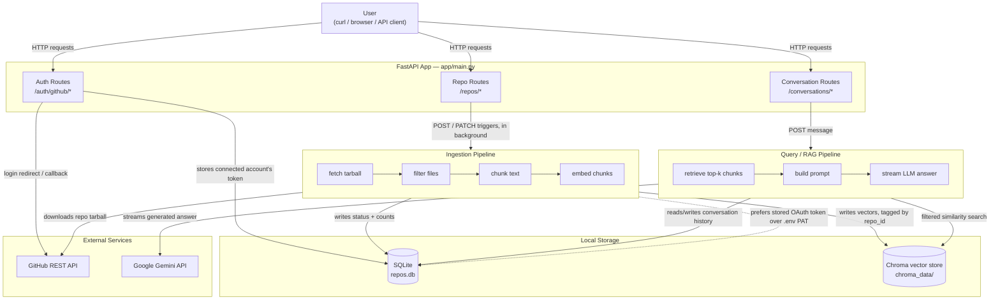

# RAG GitHub Bot

A FastAPI service that lets you point it at a GitHub repository, indexes the repo's code and docs into a searchable vector store, and then lets you **ask questions about that repo in a conversation** — the same way you'd chat with an AI about a codebase, except the answers are grounded in the repo's actual content instead of a general-purpose guess.

In short: `POST` a repo URL → it gets fetched, chunked, and embedded → you open a conversation against it → you ask questions → the bot retrieves the relevant pieces of the repo and asks an LLM to answer using only that retrieved content.

---

## Table of Contents

- [What This Project Does](#what-this-project-does)
- [Architecture Diagram](#architecture-diagram)
- [The Complete Flow, Step by Step](#the-complete-flow-step-by-step)
- [File & Function Interaction Diagram](#file--function-interaction-diagram)
- [Project Structure](#project-structure)
- [Tech Stack](#tech-stack)
- [Data Model](#data-model)
- [Setup & Installation](#setup--installation)
- [API Reference](#api-reference)
- [Design Decisions Worth Knowing](#design-decisions-worth-knowing)
- [Known Limitations](#known-limitations)
- [What's Not Built Yet](#whats-not-built-yet)

---

## What This Project Does

This is a **RAG (Retrieval-Augmented Generation) system** built specifically for GitHub repositories. RAG just means: instead of asking an LLM a question and hoping it already "knows" the answer, you first **retrieve** the most relevant pieces of real content, hand those to the LLM alongside the question, and ask it to answer **using only that content**. This is what stops the bot from making things up about your code — it can only talk about what it actually retrieved.

There are three moving parts, each covered in more detail further down:

1. **Ingestion** — pull a repo from GitHub, break it into small chunks, turn each chunk into a vector (a list of numbers that captures its meaning), and store those vectors.
2. **Conversations** — a question always belongs to a conversation, and a conversation always belongs to one repo. This is what lets the bot know *which* repo you're asking about, and lets follow-up questions ("what about the tests?") make sense without you repeating context every time.
3. **GitHub OAuth** — optionally connect your real GitHub account so the bot can index your **private** repos too, not just public ones.

---

## Architecture Diagram

This is the system from a bird's-eye view — the major pieces and how data moves between them.



**Reading this diagram in plain terms:**
- Every request starts at the FastAPI app, which routes it to one of three groups of endpoints (repos, conversations, auth).
- Creating or re-syncing a repo kicks off the **ingestion pipeline** as a background task — the API responds immediately with `status: pending` rather than making you wait for the whole repo to be processed.
- Asking a question runs the **query pipeline** — it never touches GitHub, only the already-indexed vectors.
- Everything durable lives in two places: **SQLite** (structured facts — repo status, conversations, messages, the connected GitHub token) and **Chroma** (the actual vectors used for semantic search).

---

## The Complete Flow, Step by Step

This section is a narrative walkthrough — the whole system explained in the order you'd actually experience it, from starting the server for the first time to having a full back-and-forth conversation about your code. If you only read one section to understand how everything fits together, read this one.

### 1. Starting the server

Before any request ever arrives, a few things happen automatically the moment the app boots (`uvicorn app.main:app`):

- **`app/config.py`** reads `.env` and checks that the required secrets are actually present. If `GITHUB_TOKEN` or `GEMINI_API_KEY` is missing, the app refuses to start with a clear error rather than failing mysteriously later on the first request that needs them.
- **`app/storage/db.py`** connects to `repos.db` (creating the file if it doesn't exist) and creates its four tables if they're not already there: `repos`, `conversations`, `messages`, `github_auth`.
- **`app/ingestion/embedder.py`** loads the local embedding model (`all-MiniLM-L6-v2`) into memory once. This happens at import time specifically so the model is "warm" and ready before the first real request needs it, instead of paying that load time on someone's first ingest.
- **`app/storage/vector_store.py`** opens (or creates) the Chroma collection on disk at `chroma_data/`.

By the time the server prints "Uvicorn running," everything it needs is already loaded and ready — no lazy setup surprises mid-request.

### 2. (Optional) Connecting your GitHub account

If you only ever want to index **public** repos, you can skip this step entirely — the `.env` `GITHUB_TOKEN` is enough. This step only matters if you want to index your **private** repos.

You visit `GET /auth/github/login`. The server generates a random one-time `state` value (this is CSRF protection — it makes sure whoever completes the flow next is really you, not someone else's forged request), remembers it, and redirects your browser to GitHub's consent screen. You approve access, and GitHub redirects you back to `GET /auth/github/callback` with a short-lived `code`.

The server checks the `state` matches what it remembers, then exchanges that `code` — together with a secret only the server knows (`GITHUB_CLIENT_SECRET`) — for a real access token. It uses that token to ask GitHub "who am I?", and saves both the token and your username into the single-row `github_auth` table.

From this point on, every ingestion automatically prefers this stored token over the `.env` one — checked fresh on every ingest, so it takes effect immediately without restarting the server.

### 3. Indexing your first repo

You call `POST /repos` with an owner and repo name. Here's what happens, in order:

1. **Immediately**, before any real work starts: a row is written to SQLite with `status: pending`, and the API responds right away with a `repo_id`. You are *not* kept waiting for the whole repo to download and process — that continues in the background.
2. **Fetch**: the entire repo is downloaded as a single tarball (one HTTP request, regardless of whether the repo has 5 files or 5,000), using whichever GitHub token is currently available — the connected OAuth token if you did step 2, otherwise the `.env` one.
3. **Filter**: obviously-irrelevant files are dropped — binaries, `node_modules`, `.git`, lockfiles, images, vendor directories — so nothing gets embedded that couldn't meaningfully answer a question anyway.
4. **Chunk**: each remaining file's text is split into overlapping ~600-character pieces. The overlap exists so that if something important sits right at a chunk boundary, it still shows up whole in at least one chunk.
5. **Embed**: each chunk is converted into a 384-number vector by the local embedding model — a numeric representation of what that chunk of text *means*, which is what makes semantic search possible later (finding chunks that are conceptually related to a question, not just ones that share the same words).
6. **Store**: any vectors already indexed under this `repo_id` are cleared first (this does nothing the very first time, but matters for re-syncs later), then the fresh vectors are written into Chroma, each one tagged with `repo_id`, file `path`, and `chunk_index`.
7. **Finish**: SQLite is updated to `status: completed` with the real file and chunk counts — or, if anything went wrong anywhere in steps 2–6, to `status: failed` with the actual error message, so you get an honest answer instead of a silent hang.

### 4. Checking on it

You call `GET /repos/{repo_id}` (or `GET /repos/` to see everything indexed so far) to see where things stand — `pending`, `completed`, or `failed`. This is a simple, fast SQLite read; it doesn't touch GitHub or the vector store at all.

### 5. Starting a conversation

Once a repo is `completed`, you call `POST /repos/{repo_id}/conversations` to open a conversation against it. This just creates one row in the `conversations` table, tying a new `conversation_id` to that `repo_id` **permanently** — every question you ask inside this conversation, for its entire lifetime, is understood to be about this one repo. That's the whole mechanism that lets the bot know "which repo are we talking about" without you having to say so every time.

### 6. Asking your first question

You call `POST /conversations/{conversation_id}/messages` with a question. This is where the actual "RAG" part of retrieval-augmented generation happens:

1. The conversation is looked up, and so is its repo — if the repo isn't `completed` (still indexing, or failed), the request is rejected outright with a clear error, rather than quietly searching an empty or partial index and returning a misleading answer.
2. The conversation's message history is pulled in (empty, on this first question).
3. Your question is embedded into a vector the same way repo chunks were, and used to search Chroma — filtered so only chunks from *this* conversation's `repo_id` are considered, which is what keeps a question about repo A from accidentally pulling in content from repo B.
4. Your question is saved to the conversation **before** anything is generated — so even if the next step fails, there's an honest record of what you actually asked.
5. The retrieved chunks, the (currently empty) history, and your question are all shaped into one prompt for the LLM — something like *"here's relevant code from the repo, here's the conversation so far, here's the new question, answer using only the context given, and say so if you can't."*
6. That prompt is sent to Gemini with streaming enabled, and the answer is sent back to you piece by piece as it's generated — you start seeing text almost immediately instead of waiting for the whole answer to finish. Once the full answer has streamed through, it's saved to the conversation too, along with which chunks (`sources`) it was grounded in.

### 7. Asking a follow-up question

This is where conversations earn their keep. An LLM call is stateless by itself — it has no memory of anything you asked a moment ago unless you resend it. So when you ask a second question in the same conversation, step 2 above now pulls in your last few messages (capped at a small number, not the entire history — long conversations would otherwise blow past the model's input limit and cost more per call for no benefit) and folds them into the prompt. That's what lets you ask something like *"what about the tests?"* right after asking about `main.py`, and have the bot understand what "the tests" is in relation to.

### 8. When the repo changes — re-syncing

Code changes after you've already indexed a repo. Rather than deleting the whole thing and starting over (which would also orphan any conversations pointed at it), you call `PATCH /repos/{repo_id}`. This resets the repo's status back to `pending` and re-runs the exact same fetch → filter → chunk → embed pipeline from step 3 — with one difference: right before the new vectors are stored, the old ones for that `repo_id` are deleted, so you end up with a clean, current index instead of old and new chunks piling up side by side. The `repo_id` itself never changes, so every conversation that was already pointed at this repo keeps working, uninterrupted, once the re-sync finishes.

### 9. Cleaning up

`DELETE /repos/{repo_id}` removes the repo's vectors from Chroma *and* its row from SQLite — both, not just one, which is easy to half-implement and is specifically tested for in this project. `DELETE /conversations/{conversation_id}` similarly removes every message in that conversation before removing the conversation row itself, since SQLite doesn't cascade-delete related rows on its own.

### Putting it all together

Zoom out, and the whole system is really just one loop, repeated: **index something once, then have as many grounded conversations about it as you want**, with an optional re-sync whenever the underlying code changes. Nothing in the query path ever talks to GitHub directly — by the time you're asking questions, everything the bot needs is already sitting in the vector store, which is exactly why answers come back fast and don't depend on GitHub's availability or rate limits at question-answering time.

---

## File & Function Interaction Diagram

This is the more granular view — every source file, its functions, and which function calls which. Arrows point from caller to callee.

```mermaid
graph TD
    subgraph MAIN["app/main.py"]
        app_instance["app = FastAPI()"]
    end

    subgraph ROUTES_REPOS["app/routes/repos.py"]
        r_create["create_repo()"]
        r_list["list_repos()"]
        r_get["get_repo()"]
        r_resync["resync_repo()"]
        r_delete["delete_repo()"]
    end

    subgraph ROUTES_CONV["app/routes/conversations.py"]
        c_create["create_conversation()"]
        c_list["list_conversations()"]
        c_get["get_conversation()"]
        c_delete["delete_conversation()"]
        c_send["send_message()"]
    end

    subgraph ROUTES_AUTH["app/routes/auth.py"]
        a_login["github_login()"]
        a_callback["github_callback()"]
    end

    subgraph PIPELINE["app/ingestion/pipeline.py"]
        p_ingest["ingest_repo()"]
    end

    subgraph FETCH["app/ingestion/github_fetch.py"]
        f_fetch["fetch_repo_files()"]
    end

    subgraph FILTERS["app/ingestion/filters.py"]
        fi_filter["filter_files()"]
    end

    subgraph CHUNKER["app/ingestion/chunker.py"]
        ch_files["chunk_files()"]
        ch_file["chunk_file()"]
    end

    subgraph EMBEDDER["app/ingestion/embedder.py"]
        e_embed["embed_chunks()"]
    end

    subgraph VSTORE["app/storage/vector_store.py"]
        v_add["add_chunks()"]
        v_search["search()"]
        v_delete["delete_repo()"]
    end

    subgraph DB["app/storage/db.py"]
        d_create["create_repo()"]
        d_pending["mark_pending()"]
        d_completed["mark_completed()"]
        d_failed["mark_failed()"]
        d_list["list_repos()"]
        d_get["get_repo()"]
        d_delete["delete_repo()"]
        d_cconv["create_conversation()"]
        d_gconv["get_conversation()"]
        d_lconv["list_conversations()"]
        d_dconv["delete_conversation()"]
        d_addmsg["add_message()"]
        d_getmsgs["get_messages()"]
        d_recent["get_recent_messages()"]
        d_savetok["save_github_token()"]
        d_gettok["get_github_token()"]
    end

    subgraph PROMPTS["app/query/prompts.py"]
        pr_build["build_prompt()"]
    end

    subgraph GENERATE["app/query/generate.py"]
        g_stream["stream_llm_response()"]
    end

    subgraph OAUTH["app/auth/github_oauth.py"]
        o_url["build_authorize_url()"]
        o_exchange["exchange_code_for_token()"]
    end

    subgraph EXTERNAL["External Services"]
        gh_api["GitHub REST API"]
        gemini_api["Google Gemini API"]
    end

    app_instance --> r_create & r_list & r_get & r_resync & r_delete
    app_instance --> c_create & c_list & c_get & c_delete & c_send
    app_instance --> a_login & a_callback

    r_create --> d_create
    r_create -.->|"background task"| p_ingest
    r_list --> d_list
    r_get --> d_get
    r_resync --> d_get
    r_resync --> d_pending
    r_resync -.->|"background task"| p_ingest
    r_delete --> d_get
    r_delete --> v_delete
    r_delete --> d_delete

    c_create --> d_get
    c_create --> d_cconv
    c_list --> d_lconv
    c_get --> d_gconv
    c_get --> d_getmsgs
    c_delete --> d_gconv
    c_delete --> d_dconv
    c_send --> d_gconv
    c_send --> d_get
    c_send --> d_recent
    c_send --> v_search
    c_send --> d_addmsg
    c_send --> pr_build
    c_send --> g_stream

    a_login --> o_url
    a_callback --> o_exchange
    a_callback -->|"GET /user"| gh_api
    a_callback --> d_savetok

    p_ingest --> d_gettok
    p_ingest --> f_fetch
    p_ingest --> fi_filter
    p_ingest --> ch_files
    p_ingest --> e_embed
    p_ingest --> v_delete
    p_ingest --> v_add
    p_ingest --> d_completed
    p_ingest --> d_failed

    ch_files --> ch_file
    v_add -.->|"reuses loaded model"| e_embed
    v_search -.->|"reuses loaded model"| e_embed

    f_fetch -->|"tarball download"| gh_api
    o_url -->|"consent screen"| gh_api
    o_exchange -->|"token exchange"| gh_api

    g_stream -->|"streamed completion"| gemini_api
```



**Notes on reading this diagram:**
- Solid arrows are direct function calls. Dashed arrows are looser relationships — a background task handoff, or two files sharing one already-loaded model instead of one calling the other.
- `app/storage/db.py` has the most functions by far because it's the single source of truth for everything structured: repos, conversations, messages, and the connected GitHub token. Every other file talks to storage *through* `db.py` — nothing else touches SQLite directly.
- `app/storage/vector_store.py` and `app/ingestion/embedder.py` share one embedding model loaded once at import time, rather than each loading their own copy.

---

## Project Structure

```
rag-github-bot/
├── app/
│   ├── main.py                    # FastAPI app, mounts all routers
│   ├── config.py                  # loads .env, exposes typed settings
│   │
│   ├── models/
│   │   └── schemas.py             # Pydantic request bodies
│   │
│   ├── routes/
│   │   ├── repos.py                # POST/GET/PATCH/DELETE /repos
│   │   ├── conversations.py       # conversations + the streaming Q&A endpoint
│   │   └── auth.py                # GitHub OAuth login/callback
│   │
│   ├── ingestion/
│   │   ├── pipeline.py            # orchestrates the steps below
│   │   ├── github_fetch.py        # downloads a repo as a tarball
│   │   ├── filters.py             # drops binaries/lockfiles/vendor dirs
│   │   ├── chunker.py             # splits file text into overlapping chunks
│   │   └── embedder.py            # turns chunks into vectors
│   │
│   ├── query/
│   │   ├── prompts.py             # shapes chunks + history + question into a prompt
│   │   └── generate.py            # streams the LLM's answer
│   │
│   ├── auth/
│   │   └── github_oauth.py        # OAuth URL building + code exchange
│   │
│   └── storage/
│       ├── db.py                  # all SQLite reads/writes
│       └── vector_store.py        # all Chroma reads/writes
│
├── requirements.txt
├── .env                            # secrets — never committed
├── repos.db                        # SQLite file, created on first run
├── chroma_data/                    # Chroma's on-disk vector index
└── plan.md                         # the original phased build plan
```

---

## Tech Stack

| Layer | Choice | Why |
|---|---|---|
| API framework | **FastAPI** | async-friendly, built-in streaming responses, automatic request validation via Pydantic |
| Embeddings | **sentence-transformers** (`all-MiniLM-L6-v2`) | runs locally, free, no API key, fast enough for chunk-sized text |
| Vector store | **Chroma** (`PersistentClient`) | simple to run locally, supports metadata filtering (needed for per-repo search) |
| Metadata store | **SQLite** | zero setup, more than enough for a single-instance app |
| Text chunking | **langchain-text-splitters** | recursive splitter with sensible separator fallback (paragraph → line → word → char) |
| LLM (answers) | **Google Gemini** (`gemini-flash-latest`) | streaming support, generous free tier at the time this was built |
| GitHub access | **GitHub REST API** via `requests`, PAT or OAuth token | tarball download in one request regardless of file count |

---

## Data Model

**SQLite (`repos.db`) — four tables:**

| Table | Purpose | Key columns |
|---|---|---|
| `repos` | one row per indexed repo | `repo_id` (PK), `status` (`pending`/`completed`/`failed`), `file_count`, `chunk_count`, `indexed_at`, `error_message` |
| `conversations` | one row per chat thread | `conversation_id` (PK), `repo_id` — fixed for the conversation's whole lifetime |
| `messages` | one row per turn | `message_id` (PK), `conversation_id`, `role` (`user`/`assistant`), `content`, `sources` (JSON) |
| `github_auth` | the connected GitHub account, if any | single row, enforced by `CHECK (id = 1)` — `access_token`, `github_username` |

**Chroma (`chroma_data/`) — one collection, `repo_chunks`:**

Each vector is stored with an id of `{repo_id}::{path}::{chunk_index}` and metadata `{repo_id, path, chunk_index}`. Searches are filtered `where={"repo_id": ...}` so one repo's content never leaks into another repo's answers.

---

## Setup & Installation

### 1. Install dependencies

```bash
python3 -m venv venv
source venv/bin/activate
pip install -r requirements.txt
```

### 2. Set up `.env`

```env
GITHUB_TOKEN=your_github_personal_access_token
GEMINI_API_KEY=your_gemini_api_key
GITHUB_CLIENT_ID=your_oauth_app_client_id
GITHUB_CLIENT_SECRET=your_oauth_app_client_secret
```

- **`GITHUB_TOKEN`** — a [personal access token](https://github.com/settings/tokens). Only used to raise the GitHub API rate limit (60/hr unauthenticated → 5,000/hr with a token) and as a fallback if no OAuth account is connected.
- **`GEMINI_API_KEY`** — from [Google AI Studio](https://aistudio.google.com/).
- **`GITHUB_CLIENT_ID`** / **`GITHUB_CLIENT_SECRET`** — only needed if you want the OAuth login flow (for connecting an account / private repos). Register an OAuth App at `github.com/settings/developers` with callback URL `http://127.0.0.1:8000/auth/github/callback`.

### 3. Run the server

```bash
uvicorn app.main:app --host 127.0.0.1 --port 8000
```

SQLite (`repos.db`) and the Chroma index (`chroma_data/`) are created automatically on first run.

---

## API Reference

### Repos

| Method | Path | Description |
|---|---|---|
| `POST` | `/repos/` | Ingest a repo. Body: `{"owner": "...", "repo": "..."}`. Returns immediately with `status: pending`. |
| `GET` | `/repos/` | List all indexed repos. |
| `GET` | `/repos/{repo_id}` | Get one repo's status and metadata. |
| `PATCH` | `/repos/{repo_id}` | Re-sync — re-runs ingestion for the same `repo_id`, replacing old vectors. |
| `DELETE` | `/repos/{repo_id}` | Deletes the repo's SQLite row **and** every vector tagged with its `repo_id`. |

### Conversations

| Method | Path | Description |
|---|---|---|
| `POST` | `/repos/{repo_id}/conversations` | Start a new conversation against a repo. |
| `GET` | `/conversations` | List all conversations. Optional `?repo_id=` filter. |
| `GET` | `/conversations/{conversation_id}` | Get a conversation and its full message history. |
| `DELETE` | `/conversations/{conversation_id}` | Delete a conversation and its messages. |
| `POST` | `/conversations/{conversation_id}/messages` | Ask a question. Body: `{"question": "..."}`. Response is a **streamed** answer (`text/event-stream`). |

### Auth

| Method | Path | Description |
|---|---|---|
| `GET` | `/auth/github/login` | Redirects to GitHub's OAuth consent screen. |
| `GET` | `/auth/github/callback` | GitHub redirects here after consent; stores the resulting token. |

---

## Design Decisions Worth Knowing

- **No standalone `/query` endpoint.** Every question goes through a conversation, even a "one-off" one. This avoids building a throwaway endpoint that would need replacing the moment follow-up questions and history mattered.
- **`repo_id` lives on the conversation, not on each message.** A conversation is scoped to exactly one repo for its whole life — this is the mechanism that lets the bot know which repo you're asking about.
- **The user's question is saved before the answer is generated.** If the LLM call fails partway through, the conversation still has an honest record of what was actually asked.
- **Persisting the streamed answer happens *inside* the generator function**, after its `yield` loop finishes — not after the route returns. Once `StreamingResponse` is returned, no code after that line ever runs; FastAPI just drains the generator.
- **OAuth token takes priority over the `.env` personal access token**, resolved fresh on every ingestion call (not cached at startup) — so connecting a GitHub account works immediately without a restart.
- **Re-sync (`PATCH`) reuses the exact same ingestion function as a fresh ingest**, with one addition: old vectors for that `repo_id` are deleted right before the new ones are added. This keeps the two code paths from drifting apart.

---

## Known Limitations

- **Client disconnect mid-stream loses the answer.** If a client stops reading a streamed response before it finishes, the assistant's message never gets persisted (only the user's question does). A `try/finally` partial-save is a reasonable future improvement, not something this version handles.
- **The GitHub token is stored in plaintext SQLite.** Fine for a personal, single-machine setup; a real deployment would want encryption at rest or a secrets manager.
- **Re-sync re-processes the entire repo**, not just changed files. Simplest correct version; diffing changed files is a deliberate later optimization.
- **Single connected GitHub account.** The `github_auth` table is a single row by design — there's no multi-user account system yet.
- **OAuth CSRF state is stored in memory.** Fine for one process; a multi-instance deployment would need a shared store instead.

---

## What's Not Built Yet

- **Cross-repo search** — asking a question across multiple indexed repos at once.
- **The app's own user accounts / JWT auth** — GitHub OAuth here is only used to authorize repo access, not to log into this app itself.
- **Sharing, TTS, billing/tiers, knowledge-base customization** — deferred as later, optional features.

See `plan.md` for the original phased plan this project was built against.
